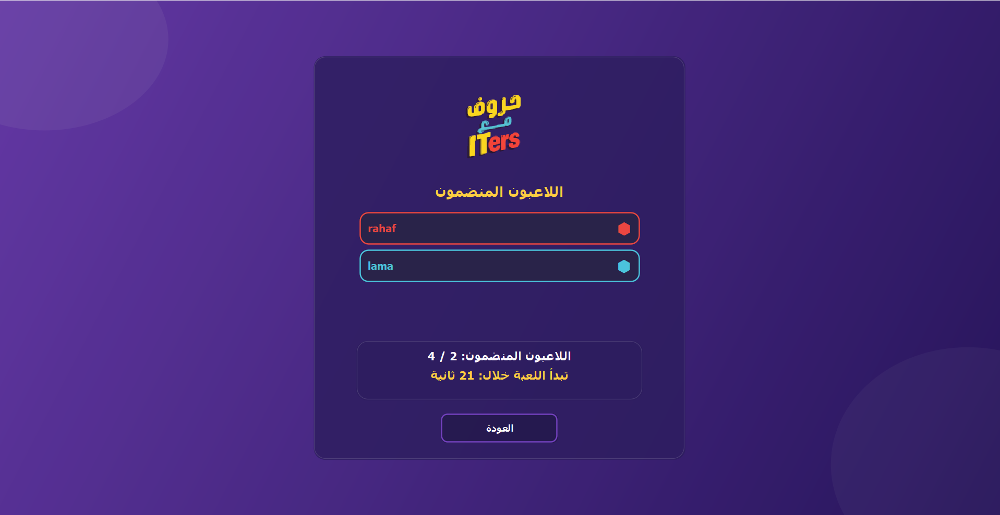
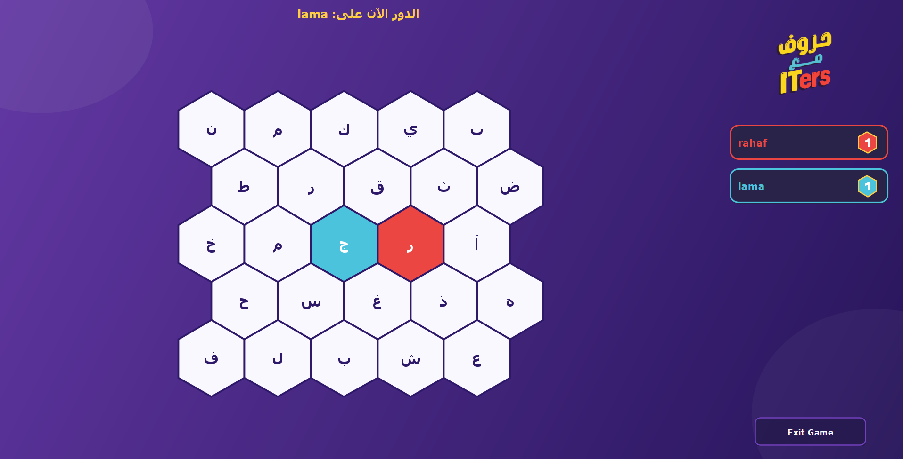
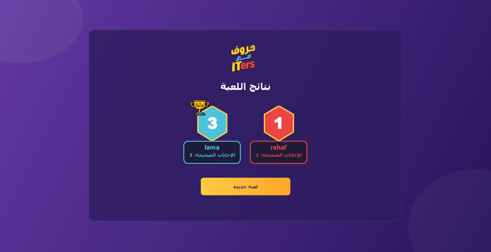

# 🎮 Java Multiplayer Network Game

A multiplayer game developed for the Computer Networks course using Java and TCP socket programming. The project demonstrates client-server architecture, real-time communication, and multithreading through an interactive graphical interface.

---

## 📸 Screenshots

### Connection Interface


### Gameplay


### Winner Screen


---

## ✨ Features

- Client-Server Architecture
- Real-time communication using TCP sockets
- Multiplayer support
- Graphical User Interface (GUI)
- Multithreading
- Executable JAR file

---

## 🛠️ Technologies Used

- Java
- Java Swing
- TCP Sockets
- Multithreading
- Apache Maven

---

## 📚 Networking Concepts

- Client-Server Model
- Socket Programming
- TCP Communication
- Concurrent Connections

---

## 🚀 Run the Project

Download the executable JAR file from the **Releases** section and run:

```bash
java -jar NetWorkPhase1-1.0-SNAPSHOT.jar
```

---

## 👥 Team Members

- Lama Altaleb
- Wjood Alhumud
- Rahaf Almaarik
- Haifa Alsulami

---

## 📄 License

Developed for academic purposes as part of the Computer Networks course.
